# HCH5 Control

**Modern local ventilation control for Dantherm HCH5 MK1 / HAC1 — with a live WebUI and Home Assistant integration.**

HCH5 Control turns a Raspberry Pi and a USB-RS485 adapter into a local controller for older HCH5 installations. The Pi reads the unit, runs the ventilation logic itself and shows everything in a responsive WebUI. Home Assistant is optional: it can follow along, send room sensors into Smart Auto and show the unit on a dashboard — but the Pi keeps running on its own when Home Assistant is offline.

> **Unofficial community project.** HCH5 Control is not developed, approved, certified or supported by Dantherm Group. Installation changes the control path of the ventilation system and is performed entirely at your own risk. Keep the original HCP4 controller so the installation can be returned to its original configuration.

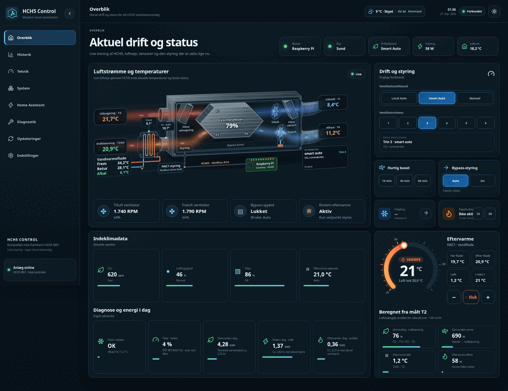

*All screenshots use example values, not measurements from a real installation.*

**Danish step-by-step guide for new users:** [Kom godt i gang](docs/kom-godt-i-gang.da.md)

## Contents

- [What you get](#what-you-get)
- [How the pieces fit together](#how-the-pieces-fit-together)
- [Hardware](#hardware)
- [Quick start](#quick-start)
- [A tour of the WebUI](#a-tour-of-the-webui)
- [Bringing Home Assistant into the control](#bringing-home-assistant-into-the-control)
- [Energy and kr values](#energy-and-kr-values)
- [Updating](#updating)
- [Safety model](#safety-model)
- [Troubleshooting](#troubleshooting)
- [Development](#development)

## What you get

- **Local controller** for the HCH5 with automatic HCP4 master arbitration and fail-safe write blocking.
- **Live WebUI** on desktop, tablet and mobile, in dark and light theme: animated airflow through the exchanger, temperatures T1–T5, fans, bypass, afterheat and filter.
- **Three operating modes:** *Local Auto* (the Pi's own CO₂/humidity logic), *Smart Auto* (the same, plus room sensors from Home Assistant) and *Manual* (fixed level 1–6).
- **Afterheat thermostat** with a drag-to-set dial, summer stop and live readings before/after the coil.
- **Automation:** weekly schedule, night reduction, holiday mode, free cooling via bypass, fireplace/stove mode, bathroom humidity policy.
- **Six adjustable fan profiles** (supply/extract % per level).
- **Energy today:** measured or estimated electricity, estimated afterheat and recovered heat, with approximate kr values when Home Assistant supplies prices.
- **History** for temperatures, water, fans, CO₂ and heat recovery, plus Raspberry Pi health.
- **Optional 1-Wire (DS18B20) sensors:** T2 before the afterheat coil, afterheat water flow/return, loft and others.
- **Home Assistant:** integration via HACS, raw TCP data on port `4196`, authenticated controller API on port `8080`, and a matching dashboard card.
- **Secure by default:** first-user administrator login, salted password hashes, sessions, CSRF protection, login rate limiting.
- **Users and roles:** separate logins for the family (*Bruger*), the service technician (*Tekniker*, optionally time-limited) and administrators.
- **Mail service (optional):** SMTP alarm mails when the unit reports a fault, and "Forgot password?" links by mail.
- **Safe updates** from the WebUI with Stable/Beta channels, backups and automatic health checks.

## How the pieces fit together

```text
                    ┌──────────────── Raspberry Pi ────────────────┐
HCH5 / HAC1 ──RS485─┤ HCH5 Control: gateway + controller + WebUI   │── WebUI  http://PI:8080
                    │   ├─ raw data mirror (read-only)   TCP 4196  │── Home Assistant integration (data)
                    │   └─ controller API (token)        TCP 8080  │── Home Assistant integration (control, rooms, energy)
                    └──────────────────────────────────────────────┘
```

- The **Pi is the source of truth.** Modes, levels, schedules, rooms and setpoints live on the Pi and are shown both in the WebUI and in Home Assistant.
- **Home Assistant never writes Modbus.** It sends *intent* (mode, level, setpoint) and *observations* (room CO₂/humidity/temperature, power, energy, prices) to the controller API. The Pi decides and performs only verified RS485 writes.
- Everything Home Assistant sends is **leased**: if Home Assistant stops, its room data expires and the Pi falls back to Local Auto.

## Hardware

- Dantherm HCH5 MK1 with HAC1;
- Raspberry Pi 2B or newer with Raspberry Pi OS Bookworm, Debian 12 or Ubuntu 22.04/24.04;
- a Linux-supported USB-RS485 adapter (preferably galvanically isolated), bus settings `19200 8E1`;
- optional DS18B20 1-Wire sensors on the Pi's GPIO4 (T2, afterheat water, loft);
- optional power meter on the unit's supply (for example a Shelly) in Home Assistant.

Turn off the ventilation unit and the adapter before changing RS485 wiring. Connect A to A and B to B, do not add termination blindly and never use an M-Bus adapter. The [Danish installation guide](docs/installation.da.md) has the full wiring notes.

For **active control**, disconnect the original HCP4 from the RS485 control path so the Pi can become master. If an HCP4 is connected and writes to the bus, the Pi yields immediately and blocks its own writes.

## Quick start

1. **Find the adapter's stable path** on the Pi:

   ```bash
   ls -l /dev/serial/by-id/
   ```

2. **Install** (replace the adapter path; omit `--enable-onewire` without DS18B20 sensors):

   ```bash
   curl -fsSL https://raw.githubusercontent.com/MRDonnii/dantherm-hch5-control/main/install.sh \
     | sudo bash -s -- \
         --device /dev/serial/by-id/usb-YOUR_ADAPTER \
         --enable-onewire
   ```

   This installs the latest stable release. Add `--beta` to install the newest beta instead. Re-running the command on an existing installation updates it and keeps login, tokens and settings.

3. **Open** `http://RASPBERRY-PI-IP:8080/` and create the owner account. There is no default password.

   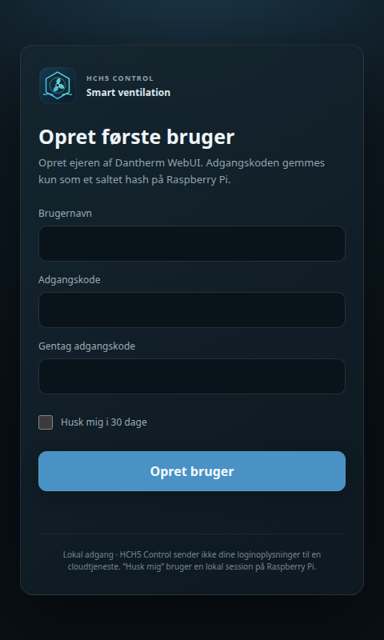

4. **Check the bus:** the overview should show *Bus: Sund* and live temperatures within a few seconds.
5. **Choose a mode** under *Drift og styring* and adjust the house and air-quality settings under **Indstillinger**.
6. Optional: [connect Home Assistant](#bringing-home-assistant-into-the-control).

## A tour of the WebUI

### Overblik

The overview shows the unit as an animated drawing: supply air (T1 → T2 → T2AH) and extract air (T3 → T4) through the exchanger, the afterheat coil with water flow/return, fans, bypass and who is in control. Next to it are the daily controls, the afterheat thermostat, indoor climate, diagnostics and today's energy.

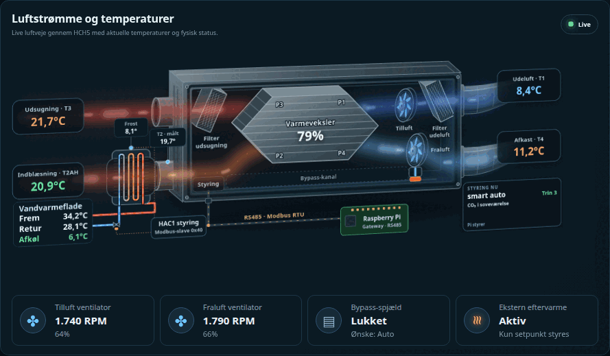

<p>
  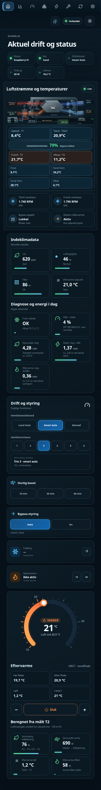
</p>

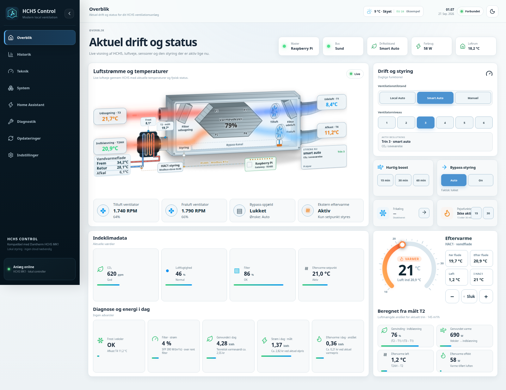

Click any temperature in the drawing to see its last 24 hours.

### Historik

Temperatures, afterheat water, fans, CO₂ and heat recovery over 1 hour to 30 days.

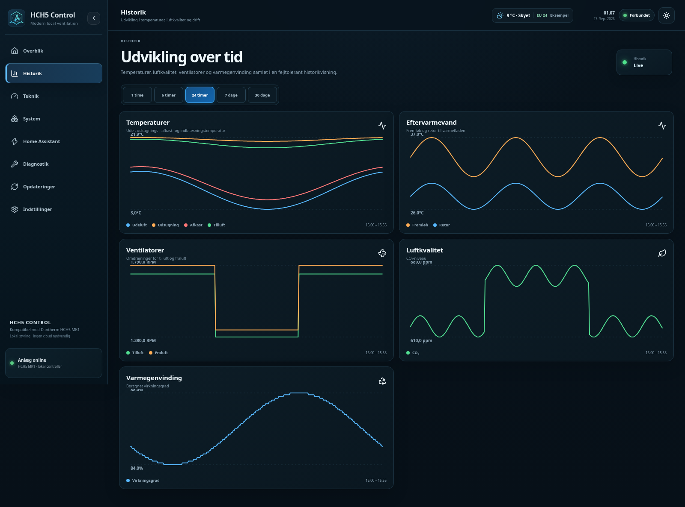

### Teknik and Diagnostik

*Teknik* shows master arbitration, hardware writes, the active decision, Smart Auto input and the raw readbacks from the bus. *Diagnostik* collects bus health and services, runs a safe system test and downloads a debug report with secrets masked.

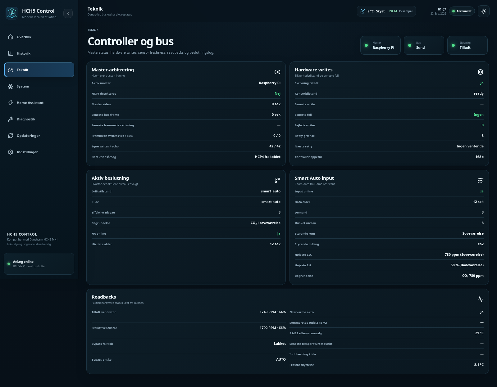

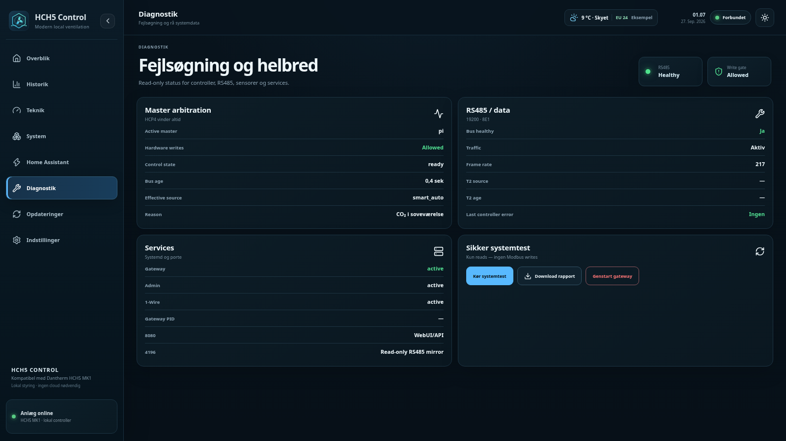

### Indstillinger

Every setting explains what it does. Sections: house and airflow, air quality, moisture, night, afterheat, free cooling, fireplace, user interface, security, 1-Wire sensors, users and mail.

### Users, technicians and mail

The first account created on `/setup` is the **administrator**. Under *Indstillinger → Brugere* the administrator can add more logins, each with a role:

| Role | Can do |
| --- | --- |
| **Administrator** | Everything, including users, mail and whether login is required. |
| **Tekniker** | Everything technical: advanced settings, sensors, Teknik, System, Diagnostik, sniffer, updates, restart/reboot and mail. Cannot manage users. |
| **Bruger** | Daily use: mode, level, Quick Boost, bypass, free cooling, fireplace and afterheat, plus history. |

A technician account can be given an expiry date, so access ends by itself after a service visit. Role changes, disabling and deletion take effect immediately, including for sessions that are already open. The server enforces every rule; the WebUI only hides what a role cannot use. Existing single-owner installations keep working and the owner becomes the administrator.

Under *Indstillinger → Mail* an administrator or technician can set up an SMTP server (presets for Gmail, Outlook.com, Microsoft 365, iCloud and one.com) and send a test mail. When mail is on:

- **Fault notifications** are sent to the listed recipients for the same alarms as the Diagnostik page (no RS485 connection, frost risk, low heat recovery, bypass not closing, afterheat without effect, missing 1-Wire sensor, clogged filter) and when the HCP4 panel takes over. You choose the minimum severity, whether to repeat a mail while an alarm stays active, and whether to mail when it clears.
- **Password reset:** the login page shows *Glemt adgangskode?*. Users with an e-mail on their account receive a single-use link that is valid for 30 minutes. The administrator can also send a reset link from the user list.

The SMTP password is stored only on the Pi (`/var/lib/dantherm-hch5-ha/webui-mail.json`, mode 0600) and is never sent back to the browser.

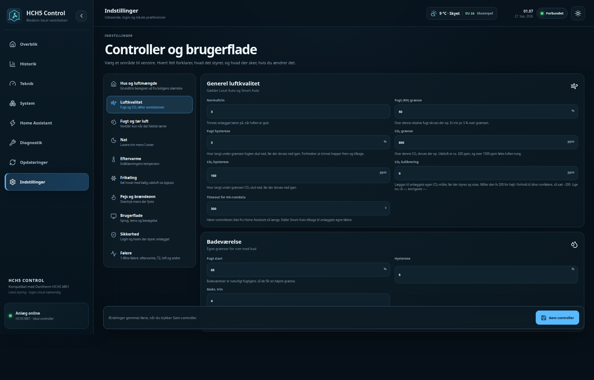

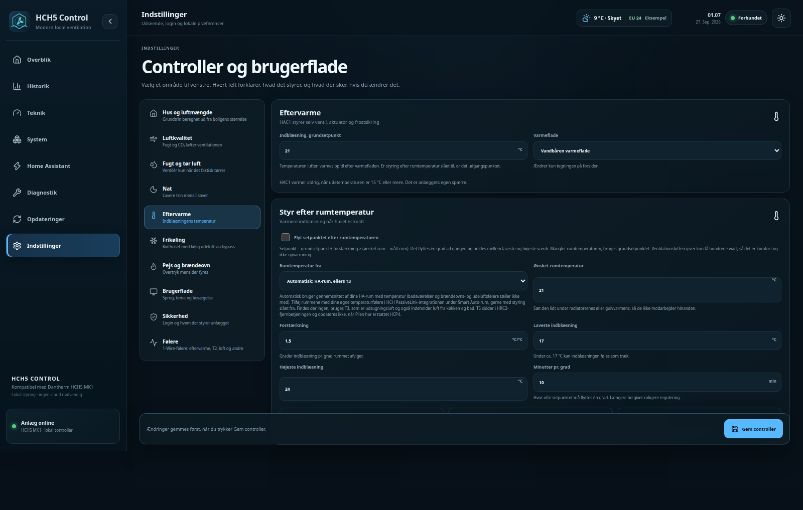

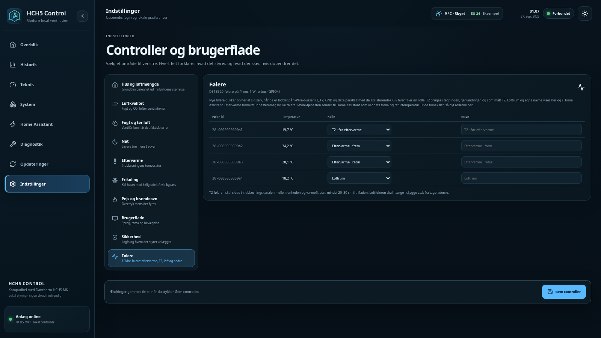

### System and Opdateringer

*System* shows the Pi's CPU, temperature, memory, disk, services and network, power profile and Wi-Fi setup. *Opdateringer* installs new versions and links straight to the Home Assistant integration and dashboard card in HACS.

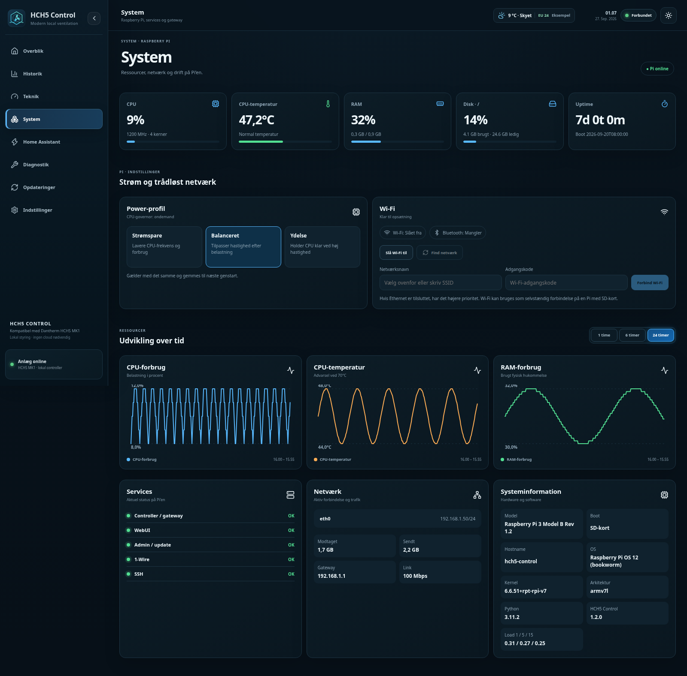

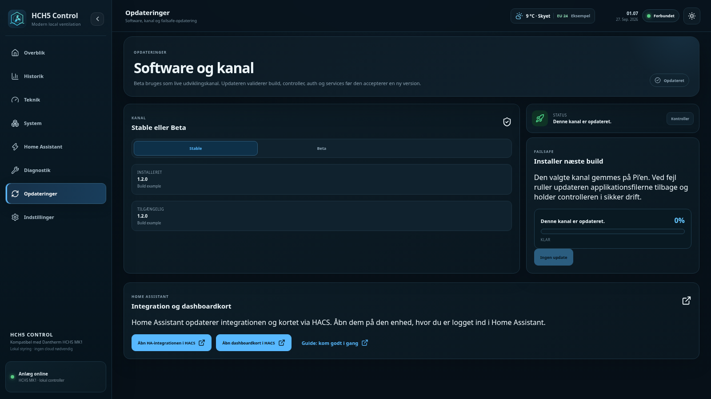

## Bringing Home Assistant into the control

Three parts work together. The first is enough to see the unit in Home Assistant; the second lets Home Assistant take part in the control; the third is the dashboard.

### 1. Install the integration and read data

[](https://my.home-assistant.io/redirect/hacs_repository/?owner=MRDonnii&repository=dantherm-hch5-control-ha&category=integration)

1. Install **Dantherm HCH5 Control** from HACS and restart Home Assistant.
2. **Settings → Devices & services → Add integration → Dantherm HCH5 Control.**
3. Choose **RS485 over TCP**, enter the Pi's IP address and port **4196**.

Home Assistant now has temperatures, fans, CO₂, humidity, bypass, filter and alarms. This data path is read-only.

### 2. Connect the controller API

1. On the Pi, show the controller token that the installer generated:

   ```bash
   sudo sed -n 's/^DANTHERM_CONTROLLER_TOKEN=//p' /etc/dantherm-passivelink-webui/gateway.env
   ```

   Keep it secret: store it only in Home Assistant, never in dashboard YAML or Git.
2. In Home Assistant open the integration → **Configure**, keep **Connect to the Raspberry Pi controller API** on and continue.
3. Enter the Pi's address, port **8080** and the token. Optional fields in the same step:
   - **Use Home Assistant sensors in Smart Auto** — turn on to send room sensors;
   - **Power meter on the unit** — live W, used for SFP and the filter power check;
   - **Unit energy today**, **Electricity price**, **Heat price** — see [Energy and kr values](#energy-and-kr-values).
4. In the menu that follows:
   - **Drift, Smart Auto og eftervarme** — mode, levels, CO₂/RH setpoints, afterheat;
   - **Ventilationsprofiler 1–6** — supply/extract % per level;
   - **Smart Auto-rum** — add rooms: name, *active*, *use for control*, priority (`auto`, `low`, `normal`, `high`, `critical`) and optional temperature, humidity and CO₂ sensors;
   - **Gem integrationsindstillinger** — saves everything.
5. Set the mode to **Smart Auto** (in the WebUI or Home Assistant).

The Pi now combines its own CO₂/humidity with the Home Assistant rooms and ventilates for the worst relevant room. Rooms named with *bad*, *bath* or *brus* get the bathroom humidity policy. Rooms with *use for control* off are shown but do not steer. The **Home Assistant** page in the WebUI shows each room's values and whether the input is fresh:

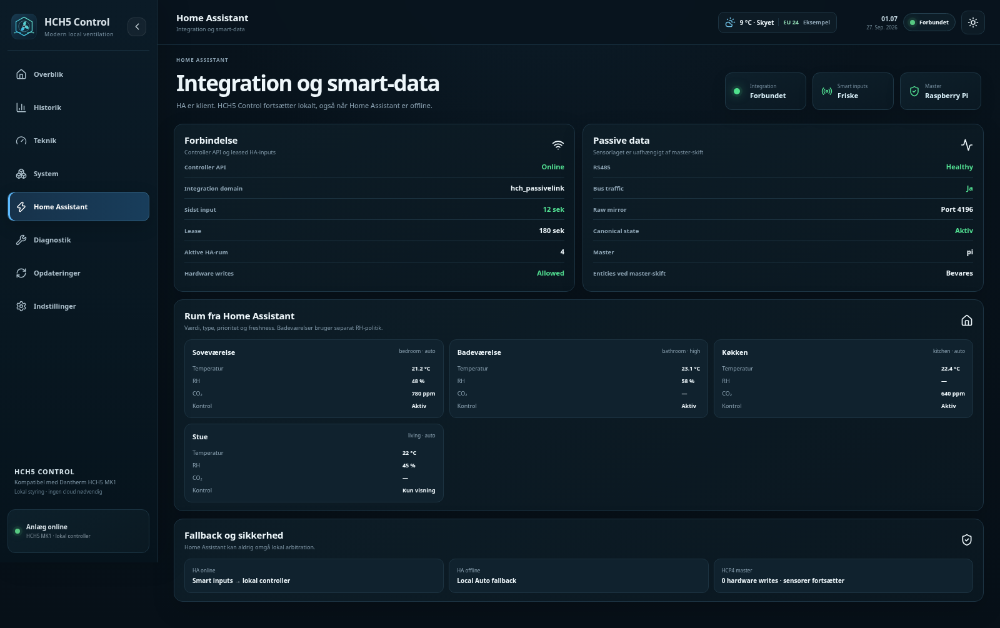

If Home Assistant stops, the room data expires after the configured validity (default 180 s) and the Pi continues in Local Auto. Changes made in the WebUI appear in Home Assistant on the next poll, and vice versa.

### 3. Add the dashboard card

[](https://my.home-assistant.io/redirect/hacs_repository/?owner=MRDonnii&repository=ha-smart-home-cards&category=plugin)

Install **Smart Home Cards** from HACS and add the **HCH5 Live Card** (`custom:ha-hch5-live-card`). It shows the same drawing, controls, afterheat thermostat and energy tiles as the WebUI. The entity options are listed in the [card's README](https://github.com/MRDonnii/ha-smart-home-cards/tree/main/src/cards/ha-hch5-live-card).

## Energy and kr values

| Figure | Source | Measured or estimated |
| --- | --- | --- |
| Electricity today | A daily **Utility Meter** in Home Assistant on the unit's kWh meter, sent via the integration | Measured |
| Electricity today (fallback) | The Pi integrates the live power in W while it is online | Estimated |
| Afterheat today | Airflow × air heat capacity × temperature rise over the coil | Estimated |
| Recovered heat today | The same, over the heat exchanger | Estimated |
| kr | kWh × the current electricity or heat price from Home Assistant | Approximate |

Recovered heat × heat price is a **theoretical** value of reused heat, not a saving on the bill. Afterheat is air-side: without a water-flow meter it is not the district-heating consumption. Prices must be in kr/kWh; øre/kWh and DKK/MWh sensors are converted by the integration. The [Danish energy guide](docs/energy-and-ha.da.md) explains the setup, including an optional YAML alternative for other systems.

## Updating

Open **Opdateringer** in the WebUI.

- **Stable** is the default channel; enable **Brug beta-kanal** only for prerelease features.
- **Søg efter opdatering** compares the installed version with the channel; **Installer opdatering** backs up, replaces program files, restarts and runs a live health check.
- Settings in `/etc/dantherm-passivelink-webui/` and controller state in `/var/lib/dantherm-hch5-ha/` are kept.
- The Home Assistant integration and card are updated in HACS; the page links to both.

## Safety model

1. HCP4 has priority whenever foreign control writes are observed.
2. `UNKNOWN` or an unhealthy bus means **zero Pi control writes**.
3. Only the central controller boundary transmits, and only physically verified frames.
4. Home Assistant sends intent and observations over an authenticated API; it never writes Modbus.
5. Data from Home Assistant is leased and expires; the Pi falls back to Local Auto.
6. Fireplace mode prevents automatic bypass requests.
7. Updates keep configuration and create rollback backups.

This software cannot make an altered HVAC installation risk-free. Check frost protection, afterheat, airflow and bypass on the actual installation after changes. If behaviour is unexpected, stop the Pi controller and restore the original HCP4.

The verified bypass request is FC06 to slave `0x01`, register `0x0044` (68): `0x0000` = AUTO, `0x00FF` = ON. The physical bypass readback is separate and drives the drawing; AUTO can coexist with an open bypass when the HCH5 itself calls for it.

## Troubleshooting

| Symptom | Check |
| --- | --- |
| *Bus* not healthy, no temperatures | `19200 8E1`, A/B swapped (power off, swap only A/B), correct `/dev/serial/by-id/...` path, no other process on the port |
| Pi never becomes master | HCP4 still connected and writing (see **Teknik → Master-arbitrering**) |
| Smart inputs *stale* | Home Assistant controller API not configured, wrong token, or room sensors unavailable |
| Energy tiles show `—` | No power meter/energy sensor selected in the integration, or price sensors not in kr/kWh |
| WebUI unreachable | `systemctl status dantherm-webui-gateway.service dantherm-webui-admin.service` and `ss -ltn | grep -E ':(4196|8080) '` |

**Diagnostik → Download rapport** creates a single text file with state, service logs and Pi health; secrets are masked, but review it before sharing because it contains local host names and addresses.

## Development

```bash
python3 -m py_compile gateway/*.py
pytest -q
cd frontend-v2 && npm ci && npm test && npm run build
bash -n install.sh install-hch5-control.sh update.sh uninstall.sh
node scripts/capture-preview.mjs   # README screenshots with example data
```

## License

MIT — see [LICENSE](LICENSE).
