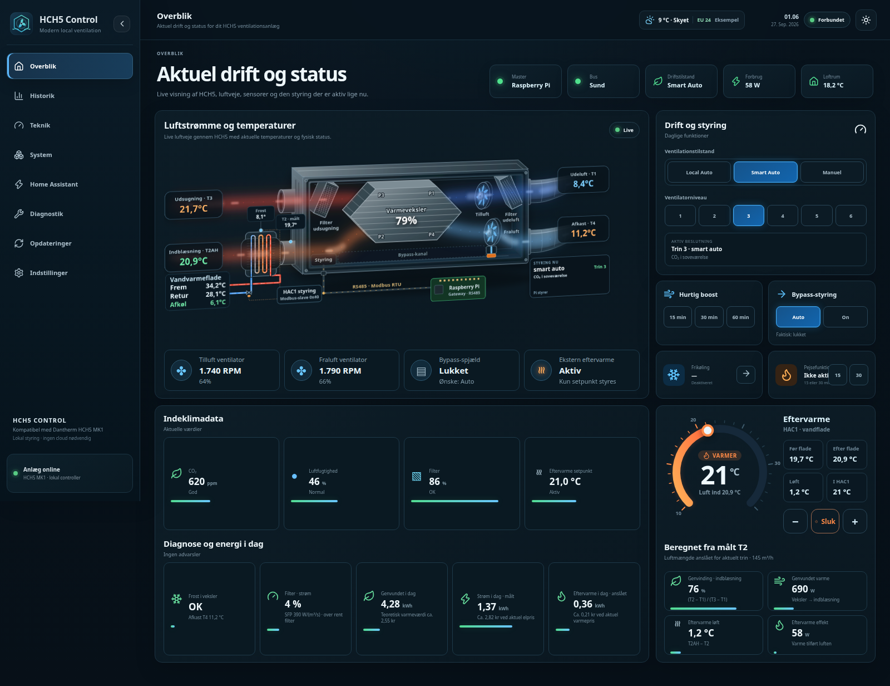

# Kom godt i gang med HCH5 Control

Denne guide tager dig fra en tom Raspberry Pi til et HCH5-anlæg, der styres lokalt af Pi'en og spiller sammen med Home Assistant. Du kan stoppe efter trin 4, hvis du kun vil bruge WebUI'en.

> HCH5 Control er et uofficielt fællesskabsprojekt og er ikke udviklet, godkendt eller supporteret af Dantherm Group. Du ændrer anlæggets styring på eget ansvar. Gem den originale HCP4, så anlægget kan føres tilbage.

*Skærmbillederne viser eksempelværdier, ikke målinger fra et rigtigt anlæg.*

## Sådan hænger det sammen

- **Raspberry Pi'en** læser anlægget via RS485, styrer ventilationen og viser alt i WebUI'en på port `8080`.
- **Home Assistant** er valgfri. Integrationen læser data via port `4196` og kan sende rum-sensorer, strøm og priser til Pi'en via controller-API'en på port `8080`.
- **Pi'en bestemmer altid.** Home Assistant sender kun ønsker og målinger; Pi'en træffer beslutningen og skriver kun verificerede kommandoer til anlægget. Stopper Home Assistant, fortsætter Pi'en selv i Local Auto.

## 1. Det skal du bruge

- Dantherm HCH5 MK1 med HAC1;
- Raspberry Pi 2B eller nyere med Raspberry Pi OS Bookworm (Debian 12 og Ubuntu 22.04/24.04 virker også);
- en USB-RS485-adapter, helst galvanisk isoleret;
- valgfrit: DS18B20-følere på Pi'ens GPIO4 til T2 før eftervarmefladen, eftervarmevandets frem/retur og loftrum;
- valgfrit: en effektmåler på anlæggets forsyning (fx en Shelly) i Home Assistant.

## 2. Tilslut RS485

Sluk anlæg og adapter først. Forbind A til A og B til B (stol ikke på farver). Tilføj ikke en ekstra 120 Ω-terminering, og brug aldrig en M-Bus-adapter. Kommer der ingen data, så sluk og byt kun A og B. Detaljer og tabel over mærkninger står i [installationsguiden](installation.da.md#sikker-rs485-tilslutning).

Skal Pi'en styre anlægget, kobles HCP4 fra RS485-styrevejen. Er HCP4 tilsluttet og skriver på bussen, trækker Pi'en sig straks og blokerer sine egne skrivninger.

## 3. Installér på Pi'en

Find adapterens faste sti:

```bash
ls -l /dev/serial/by-id/
```

Installér (udskift stien; udelad `--enable-onewire` uden DS18B20-følere):

```bash
curl -fsSL https://raw.githubusercontent.com/MRDonnii/dantherm-hch5-control/main/install.sh \
  | sudo bash -s -- \
      --device /dev/serial/by-id/usb-DIN_ADAPTER \
      --enable-onewire
```

Kommandoen installerer seneste stabile version. Tilføj `--beta` for seneste beta. Kører du den igen på en eksisterende installation, bliver den opdateret, og login, tokens og indstillinger bevares.

## 4. Første login og første indstillinger

Åbn `http://PI-IP:8080/`. Første gang opretter du selv ejerkontoen – der findes ingen standardadgangskode.


Kontrollér derefter på **Overblik**:

- **Bus: Sund** og temperaturer, der opdateres;
- **Master: Raspberry Pi**, når HCP4 er koblet fra.



Gå så til **Indstillinger** og tag disse i rækkefølge:

1. **Hus og luftmængde** – boligens størrelse giver grundtrinnet. Slå **Luftbalance** på *Auto*, så udsugningen altid er lidt større end indblæsningen (5 % i m³/h) på alle trin. Har du en T2-føler før eftervarmen, lærer Pi'en selv, hvor meget luft kanalerne giver pr. omdrejning.
2. **Luftkvalitet** – normaltrin og grænser for fugt og CO₂.
3. **Nat**, **Frikøling**, **Pejs og brændeovn** efter behov.
4. **Eftervarme** – eftervarmefladens type (el eller vand) og sommerstop.
5. **Følere** – giv DS18B20-følerne en rolle: *T2 · før eftervarme*, *Eftervarme · frem/retur*, *Loftrum* eller et eget navn.


Tryk **Gem controller**. Vælg til sidst driftstilstand under **Drift og styring** på overblikket:

| Tilstand | Hvad sker der |
| --- | --- |
| **Local Auto** | Pi'en styrer efter anlæggets egen CO₂ og fugt. Virker helt uden Home Assistant. |
| **Smart Auto** | Som Local Auto, men også med rum-sensorer fra Home Assistant. Det værste relevante rum bestemmer. |
| **Manuel** | Fast trin 1–6. |

Eftervarmen styres med termostaten i højre side: træk i skiven eller brug − / +, og tænd/sluk med knappen.

## 5. Home Assistant: se anlægget

1. Installér **Dantherm HCH5 Control** i HACS: [åbn i HACS](https://my.home-assistant.io/redirect/hacs_repository/?owner=MRDonnii&repository=dantherm-hch5-control-ha&category=integration). Genstart Home Assistant.
2. **Indstillinger → Enheder og tjenester → Tilføj integration → Dantherm HCH5 Control.**
3. Vælg **RS485 over TCP**, skriv Pi'ens IP og port **4196**.

Nu har Home Assistant temperaturer, blæsere, CO₂, fugt, bypass, filter og alarmer.

## 6. Home Assistant: med i styringen

1. Vis controller-tokenet på Pi'en:

   ```bash
   sudo sed -n 's/^DANTHERM_CONTROLLER_TOKEN=//p' /etc/dantherm-passivelink-webui/gateway.env
   ```

   Hold det hemmeligt. Det gemmes kun i integrationen – aldrig i dashboard-YAML eller Git.
2. Åbn integrationen → **Konfigurér**. Lad **Forbind til Raspberry Pi-controllerens API** være slået til og gå videre.
3. I trinnet **Raspberry Pi-controller og Smart Auto** skriver du Pi'ens IP, port **8080** og tokenet. Slå **Brug Home Assistant-sensorer i Smart Auto** til. Vælg evt. også:
   - **Effektmåler på anlægget** (W) – giver forbrug, SFP og filtertjek;
   - **Dantherms elforbrug i dag**, **Elpris** og **Varmepris** – se trin 8.
4. I menuen **Controlleropsætning**:
   - **Smart Auto-rum → Tilføj rum**: rumnavn, *Aktiv*, *Brug til styring*, prioritet (`auto`, `low`, `normal`, `high`, `critical`) og de sensorer, rummet har (temperatur, luftfugtighed, CO₂). Rum med *bad*, *bath* eller *brus* i navnet får automatisk badeværelsets egen fugtpolitik.
   - **Drift, Smart Auto og eftervarme** og **Ventilationsprofiler 1–6** kan også justeres herfra.
   - **Gem integrationsindstillinger**.
5. Sæt driftstilstanden til **Smart Auto**.

Siden **Home Assistant** i WebUI'en viser nu hvert rum, dets værdier og om data er friske:


Rum med *Brug til styring* slået fra vises kun. Holder Home Assistant op med at sende, udløber rumdata efter den valgte gyldighed (standard 180 sekunder), og Pi'en fortsætter i Local Auto.

## 7. Dashboardkortet

Installér **Smart Home Cards** i HACS: [åbn i HACS](https://my.home-assistant.io/redirect/hacs_repository/?owner=MRDonnii&repository=ha-smart-home-cards&category=plugin). Tilføj kortet `custom:ha-hch5-live-card` på et dashboard og peg dets `entities` på integrationens sensorer. Kortet viser samme tegning, betjening, eftervarmetermostat og energifelter som WebUI'en. Alle felter står i [kortets README](https://github.com/MRDonnii/ha-smart-home-cards/tree/main/src/cards/ha-hch5-live-card). Lav en hård browseropdatering efter en kortopdatering.

## 8. Strøm og varme i kr (valgfrit)

1. Har anlægget en kWh-måler i Home Assistant, så opret hjælperen **Forbrugsmåler (Utility Meter)** med måleren som kilde og cyklus **Daglig**.
2. Vælg den nye sensor som **Dantherms elforbrug i dag** i integrationen (trin 6.3), og vælg din elpris og varmepris i **kr/kWh** (øre/kWh omregnes automatisk).
3. Overblikket viser så **Strøm i dag · målt** og ca. kr for strøm, eftervarme og den teoretiske værdi af genvundet varme.

Eftervarme og genvundet varme er beregnet ud fra luftens temperaturer og anslået luftmængde – ikke målt på vandsiden. Genvundet varme i kr er en teoretisk værdi, ikke en besparelse på regningen. Mere i [energiguiden](energy-and-ha.da.md).

## 9. Opdatering

Åbn **Opdateringer** i WebUI'en. **Stabil** er standard; slå **Brug beta-kanal** til, hvis du vil have nye funktioner før alle andre. **Installer opdatering** tager backup, opdaterer, genstarter og kontrollerer, at alt kører. Integration og kort opdateres i HACS – siden har genveje til begge.


## Hvis noget ikke virker

- **Ingen data / bus ikke sund:** kontrollér `19200 8E1`, adapterstien og A/B.
- **Pi'en bliver ikke master:** HCP4 skriver stadig på bussen – se **Teknik → Master-arbitrering**.
- **Smart inputs "stale":** forkert token/adresse i integrationen, eller rum-sensorerne er utilgængelige.
- **Energifelter viser —:** ingen effekt-/energisensor valgt, eller priserne er ikke i kr/kWh.
- **Diagnostik → Download rapport** laver én tekstfil med status og logs. Hemmeligheder maskeres, men gennemse filen før du deler den.

Eksponér aldrig port 8080 eller 4196 direkte på internettet. Brug VPN eller en betroet reverse proxy med HTTPS til fjernadgang.
